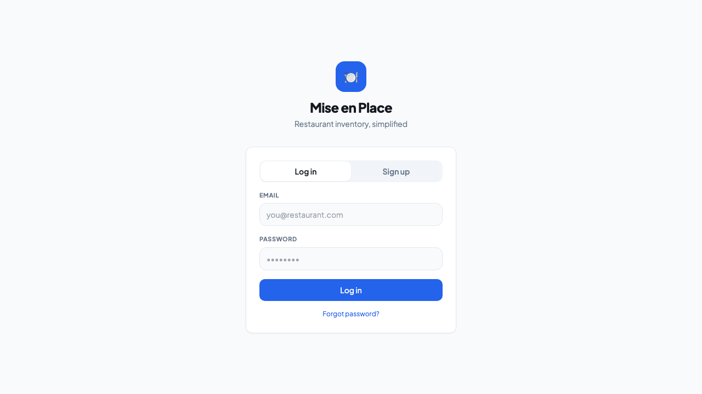
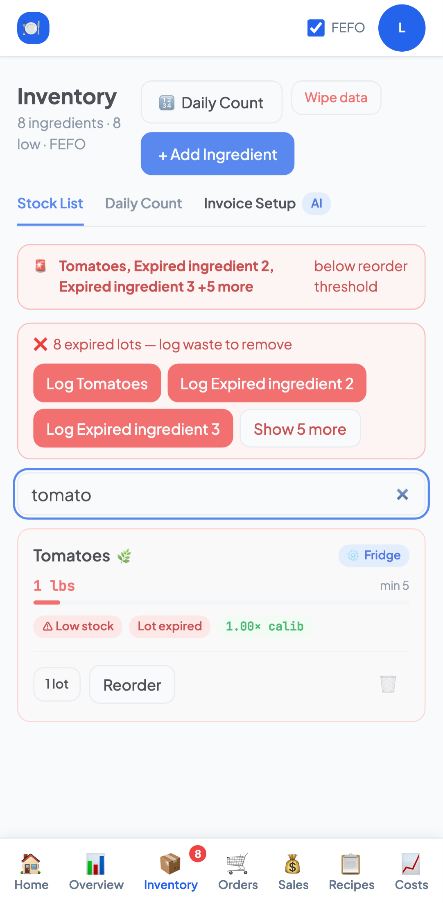

# Product and engineering review

Reviewed July 28, 2026 against the public Vercel application and the checked-out
source. The dedicated production test account was used read-only; no onboarding,
sales, counts, waste, scans, orders, or other production mutations were submitted.

The account had already completed onboarding, so first-run onboarding was reviewed
from source and through local mocked Supabase states rather than by resetting or
creating production data.

## Priorities

### Critical fixes

- **Implemented:** stop tracking `.env`, document safe environment setup, and keep
  provider credentials out of browser-readable POS queries.
- **Implemented:** require a valid Supabase user for AI scans and assistant calls;
  cap and sanitize model inputs and outputs.
- **Implemented:** verify Clover and Toast webhook authenticity, use constant-time
  signature comparisons, cap payloads, and deduplicate provider retries.
- **Implemented:** reconcile physical counts, ingredient totals, lots, and waste
  events through transactional database functions.
- **Deployment requirement:** apply the three new migrations and deploy the changed
  Edge Functions before validating the preview. The Vercel and Supabase project
  values must refer to the same intended environment.
- **Remaining product/integration work:** provider webhooks such as Clover updates
  do not contain full sale line items by themselves. Complete and sandbox-test each
  provider adapter with its API before advertising automatic multi-POS importing.

### High-impact improvements

- **Implemented:** add honest loading/error states, clear account-scoped query
  caches on identity changes, and make tabs deep-linkable with browser history.
- **Implemented:** remove hard-coded waste-savings claims and clarify that POS sales
  are imported for review rather than deducting inventory immediately.
- **Implemented:** fix narrow-screen Inventory overflow, collapse large expired-lot
  queues, add inventory search, and improve mobile sign-out/navigation spacing.
- **Implemented:** label repeated controls and form fields, expose pressed states,
  make invoice upload keyboard-accessible, and hide the closed assistant from the
  accessibility tree.
- **Implemented:** preserve partial scan/import failures for retry instead of
  silently discarding successful or failed work.
- **Remaining:** make onboarding one server-side transaction. Client-side error
  checks now prevent false completion, but a network failure after an early insert
  can still leave partial setup data.
- **Remaining:** turn Orders into a lifecycle (draft, sent, received, history) and
  connect receiving to lots; current purchase orders are generated mail drafts.
- **Remaining:** either implement count-driven calibration updates or remove the
  calibration feature language. Factors currently remain at their defaults.

### Optional polish

- Reduce the seven-item mobile navigation density or move lower-frequency areas
  into a More menu.
- Replace emoji-only visual language with a consistent icon system and keep the
  accessible names.
- Split the largest feature components and consolidate the two POS integration
  models (`pos_connections` and `pos_integrations`) to reduce maintenance cost.
- Add richer inventory filters, saved views, order history, and measured waste
  reporting once the underlying workflows exist.

## Screenshots

| Public authentication | Mobile inventory regression |
| --- | --- |
|  |  |

The authenticated regression screenshots use deterministic, mocked Supabase data
and `.invalid` example credentials. They do not contain production data or secrets.

## Verification

- `npm test` — 25 passing
- `npx tsc --noEmit` — passing
- `npm run lint` — 0 errors; 7 existing shadcn Fast Refresh warnings
- `npm run build` — passing
- `npm run test:e2e` — 6 passing across desktop Chromium and Pixel 7
- `npm audit --omit=dev` — 2 reported high advisories in React Router's unused RSC
  mode; this app uses declarative `BrowserRouter`, and no patched 7.x release is
  currently available
- Full `npm audit` additionally reports development-only ESLint/Tailwind glob
  expansion and Vite dev-server advisories that require major-version upgrades
